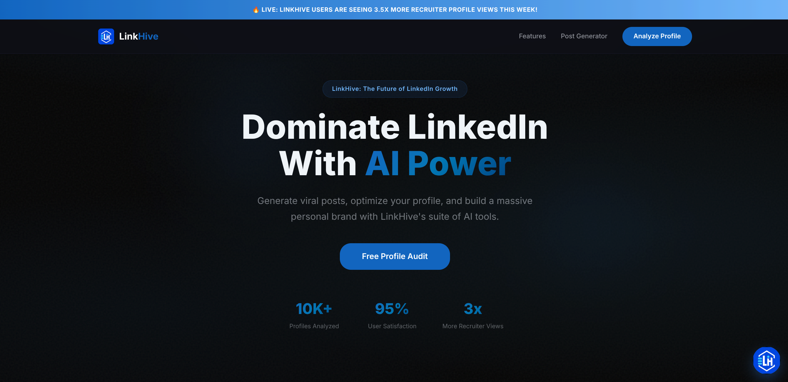

<div align="center">
  

  # 🐝 LinkHive: Your AI-Powered LinkedIn Growth Colony

  **Stop shouting into the void. Start building a buzz.**
  
  [](https://nextjs.org/)
  [](https://tailwindcss.com/)
  [](https://react.dev/)
  [](https://openai.com/)
  [](https://nubela.co/proxycurl/)

  *LinkHive is the ultimate ecosystem for LinkedIn creators, job seekers, and personal brands. We turn static "Digital Resumes" into highly-optimized "Opportunity Magnets".*
</div>

---

## 🍯 The Hive Manifesto

In a world where attention is the new currency, your LinkedIn profile is your digital storefront. Most professionals are operating with a "Closed" sign and dusty windows. 

**LinkHive** provides a complete suite of AI-powered tools to:
- ⚡ **Optimize** your profile sections with surgical, data-backed precision.
- ⚡ **Generate** viral content and high-quality graphics in seconds.
- ⚡ **Scale** your comments and connection requests.
- ⚡ **Track** your profile scoring progression over time.

---

## 🐝 Honey-Sweet Features

### 1️⃣ AI Profile Auditor (The Royal Scan)
Provide your current profile details or fetch them instantly to receive a comprehensive analysis:
- **0-100 Scoring:** Real-time breakdown of Headline, About, Skills, and Experience strength.
- **AI Section Rewriter:** Instantly get multiple AI-crafted versions of Headlines and About sections tailored to your target roles.
- **ATS & SEO Checker:** Identify essential keywords missing in your profile and ensure your text parses perfectly for Applicant Tracking Systems.
- **Recruiter Verdict:** Simulates how a professional recruiter reads your profile to give you a one-sentence, unfiltered assessment.

### 2️⃣ Roast Mode 🔥 (The Brutal Truth)
Tired of generic advice? Get funny, brutally honest critiques targeting your profile weaknesses. Perfect for those who can handle the heat and want to fix their digital presence fast.

### 3️⃣ Viral Post Generator (The Nectar)
Staring at a blank screen is a thing of the past.
- **Scroll-Stopping Hooks:** Generates high-engagement posts using proven creator structures.
- **Structured Formatting:** Uses clean spacing and clear bullets for readability.
- **Hashtag Selection:** Appends contextually relevant hashtags (no emojis, keeping it professional).

### 4️⃣ Connection Message Polisher (The Reachout)
Never send a boring "I'd like to add you to my professional network" request again.
- **Under 300 Characters:** Tailors messages specifically to fit LinkedIn's tight limit.
- **Smart Adaptability:** Polishes drafts depending on context (e.g., reaching out to a recruiter, colleague, or industry leader).

### 5️⃣ Comment Reply Assistant (The Buzz)
Scale your networking and boost your visibility in comments.
- **Multiple Engagement Tones:** Select **Insightful** (adds value), **Supporting** (validation), **Contrarian** (polite counterpoints), or **Humorous** (witty/lighthearted).
- **Profile Integration:** Incorporates your current career target to ensure your comments establish your personal brand.

### 6️⃣ Multi-Theme Carousel PDF Builder (The Comb)
Create native LinkedIn PDF slide decks—the highest-performing post format on the platform.
- **Pre-Designed Themes:** Choose between Cobalt Power, Amethyst Tech, Sunset Brand, Emerald Growth, and Minimal Stark.
- **Slide-by-Slide Editor:** Live interactive editor allowing you to tweak titles, subtitles, and bullet points.
- **High-Res Export:** Downloads high-resolution, multi-page PDFs ready for direct LinkedIn upload.

### 7️⃣ Audit Progression History (The Honeycombs)
Track your LinkedIn profile improvements over time.
- **Dynamic Charts:** Visual progression charts for Overall Score, Recruiter Readiness, and ATS Score powered by Chart.js.
- **Local Persistence:** Securely saves audits to your local storage to prevent data loss.
- **Dashboard Restoration:** Restore any historical audit with one click to see how your recommendations looked.

---

## 🛠️ Bee-hind the Scenes (Tech Stacks)

LinkHive is built on a high-performance modern web stack:

- **Framework:** [Next.js 16](https://nextjs.org/) (App Router & Turbopack)
- **Library:** [React 19](https://react.dev/) (Server Actions & Client State)
- **Styling:** [Tailwind CSS v4](https://tailwindcss.com/) & PostCSS
- **Animations:** [Framer Motion](https://www.framer.com/motion/) (smooth micro-interactions)
- **Charts:** [Chart.js](https://www.chartjs.org/) & [react-chartjs-2](https://react-chartjs-2.js.org/) (for interactive graphs)
- **Document Compilers:** [jsPDF](https://github.com/parallax/jsPDF) & [html2canvas](https://html2canvas.hertzen.com/) (PDF slide compilation)
- **Data Integrations:** [Proxycurl API](https://nubela.co/proxycurl/) (to fetch LinkedIn profile data directly via URLs)

---

## 📂 Project Structure

```text
linkedaudit/
├── src/
│   ├── app/
│   │   ├── actions/                # Next.js Server Actions
│   │   │   ├── ai-actions.ts       # OpenAI / LLM integrations
│   │   │   └── linkedin-actions.ts # Proxycurl API wrapper
│   │   ├── api/                    # API Route Handlers
│   │   ├── audit/                  # Profile Auditor Page
│   │   ├── carousel-generator/     # Carousel Builder Page
│   │   ├── dashboard/              # Core Profile Dashboard
│   │   ├── history/                # Audit History & Progress Charts
│   │   ├── post-generator/         # Post Creator Tool
│   │   ├── reply-assistant/        # Comment Reply Assistant Page
│   │   ├── globals.css             # Main Styling and Animations
│   │   └── layout.tsx & page.tsx   # Base Entry Pages
│   ├── components/                 # Shared UI Components
│   │   ├── dashboard/              # Dashboard-specific elements
│   │   └── layout/                 # Header, Footer, Navbar, Reviews
│   ├── lib/
│   │   └── ai-service.ts           # Core LLM SDK Setup
│   └── types/                      # TypeScript Definitions
```

---

## 🚀 Get the Buzz Started

### 1. Clone & Install
```bash
git clone https://github.com/your-username/linkedaudit.git
cd linkedaudit
npm install
```

### 2. Configure Environment Variables
Create a `.env.local` file inside the `linkedaudit` folder:
```env
# AI Service Credentials (OpenAI or compatible, e.g., DeepSeek)
OPENAI_API_KEY=your_openai_or_deepseek_api_key
OPENAI_API_BASE=https://api.openai.com/v1 # Customize if using alternative endpoints
OPENAI_MODEL=gpt-4o # Model selector

# Live Profile Scraper (Optional - to import profiles directly via URL)
PROXYCURL_API_KEY=your_proxycurl_api_key
```

### 3. Launch the App
```bash
npm run dev
```
Open [http://localhost:3000](http://localhost:3000) in your browser to experience LinkHive.

---

## 📸 Interactive Showcase

| **Smart Dashboard** | **Profile Auditor** | **Carousel Builder** |
| :---: | :---: | :---: |
|  |  |  |

---

#### 🤝 Join the Colony

Contributions are welcome! Whether you are adding a new viral hook framework, template designs, or additional audit scoring variables:
1. **Fork** the repository.
2. **Create** a descriptive feature branch (`git checkout -b feature/cool-new-tool`).
3. **Commit** your updates (`git commit -m 'Added cool new tool'`).
4. **Push** your branch (`git push origin feature/cool-new-tool`).
5. **Open a Pull Request** to the main repository.

---

<div align="center">
  <b>Handcrafted with 💛❤️ by <a href="https://www.linkedin.com/in/kalaiscript/">Kalaiyarasan</a></b><br>
  <i>Building the future of professional branding, one line of code at a time.</i>
</div>
